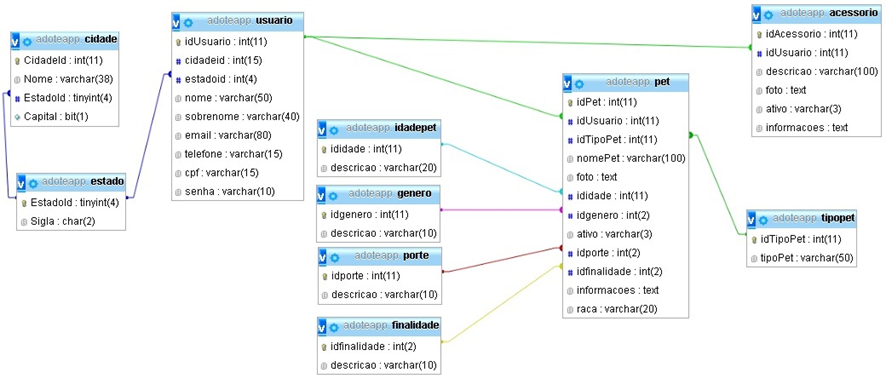

# Base-de-dados-relacionais-Loja-de-Pet
Banco de dados relacional com MySQL - para uma loja de adoção de pets

- [x] Crie os comandos SQL para a criação das tabelas, conforme especificado no diagrama. Certifique-se de que todos os relacionamentos entre as tabelas estão definidos corretamente, utilizando chaves primárias e estrangeiras quando necessário.

Após criar as tabelas, elabore consultas para as seguintes questões:

Consultas a serem realizadas:

- [x] Listar todos os usuários com suas cidades e estados.
- [x] Contar o número de pets por tipo (cachorro, gato, etc.).
- [x] Listar todos os pets ativos para adoção, com detalhes (nome, idade, gênero, tipo, porte, etc.).
- [x] Listar todos os acessórios de um usuário específico (por exemplo, idUsuario = 1).
- [x] Obter a quantidade de pets por porte (pequeno, médio, grande).

- [ ] 🚀 aumente o banco, crie novas tabelas, crie novas triggers e procedures e acima de tudo divirta-se ! ❤️👍👩‍💻😁

-- BANCO DE DADOS
CREATE DATABASE IF NOT EXISTS adoteapp -- Cria banco de dados.
CHARACTER SET utf8mb4
COLLATE utf8mb4_general_ci;	
/*O comando CREATE DATABASE adoteapp está criando o banco de dados chamado adoteapp.
A configuração CHARACTER SET utf8mb4 define que o banco usará o charset utf8mb4, que pode armazenar uma gama maior de caracteres, 
incluindo emojis e caracteres de outras línguas que exigem até 4 bytes por caractere.
A collation utf8mb4_general_ci define que as comparações de texto no banco de dados serão feitas de maneira geral e insensível a maiúsculas/minúsculas.*/
USE adoteapp; -- Utilizar o banco de dados.

-- ---------------------------------------------------------------------------------------------------------------------------
-- TABELAS

/*criando as tabelas inserindo dados (PK) e (FK);
 para gerar os relacionamentos entre as tabelas da base de dados*/
 
 CREATE TABLE IF NOT EXISTS adoteapp_estado(
id_estado TINYINT UNSIGNED NOT NULL AUTO_INCREMENT,
sigla CHAR(2) NOT NULL,
PRIMARY KEY (id_estado)
)DEFAULT CHARSET = utf8mb4 COLLATE = utf8mb4_general_ci;

CREATE TABLE IF NOT EXISTS adoteapp_cidade(
id_cidade INT(11) NOT NULL UNIQUE AUTO_INCREMENT,
nome VARCHAR(38),
id_estado TINYINT UNSIGNED,
capital BIT(1),
PRIMARY KEY (id_cidade),
FOREIGN KEY (id_estado) REFERENCES adoteapp_estado (id_estado) ON DELETE CASCADE
)DEFAULT CHARSET = utf8mb4 COLLATE = utf8mb4_general_ci;

CREATE TABLE IF NOT EXISTS adoteapp_usuario(
id_usuario INT(11)NOT NULL UNIQUE AUTO_INCREMENT,
id_cidade INT(11),
id_estado TINYINT UNSIGNED,
nome VARCHAR(50) NOT NULL,
sobrenome VARCHAR(40) NOT NULL,
email VARCHAR(80) NOT NULL UNIQUE CHECK (email REGEXP '^[a-zA-Z0-9._%+-]+@[a-zA-Z0-9.-]+\\.[a-zA-Z]{2,}$'),
telefone VARCHAR(15) NOT NULL,
CONSTRAINT chk_telefone CHECK (telefone REGEXP '^\\+\\d{2} \\(\\d{2}\\) \\d{5}-\\d{4}$'), -- Valida o padrão
/*O REGEXP (abreviação de Regular Expression, ou expressão regular),
é um operador usado em SQL para realizar comparações entre valores de colunas e padrões definidos. 
Ele permite verificar se os dados em uma coluna correspondem a um determinado formato ou conjunto de regras.
*/
cpf VARCHAR(14) NOT NULL UNIQUE,
CONSTRAINT chk_cpf_formato CHECK (cpf REGEXP '^([0-9]{11}|[0-9]{3}\\.[0-9]{3}\\.[0-9]{3}\\-[0-9]{2})$'),

/*Padrão Explicado:
^: Início do valor.
[0-9]{11}: Aceita exatamente 11 dígitos para CPF sem formatação.
|: Ou (alternativa para diferentes formatos).
[0-9]{3}\\.[0-9]{3}\\.[0-9]{3}\\-[0-9]{2}: Formato do CPF com pontos e hífen.
$: Final do valor.
*/
senha VARCHAR(255) NOT NULL,
CONSTRAINT chk_senha_tamanho CHECK (CHAR_LENGTH(senha) >= 8 AND CHAR_LENGTH(senha) <= 50),
/*Explicação:
CHAR_LENGTH(senha): Calcula o número de caracteres na senha.
A validação exige entre 8 e 50 caracteres para a senha.
*/
PRIMARY KEY (id_usuario),
FOREIGN KEY (id_cidade) REFERENCES adoteapp_cidade(id_cidade) ON DELETE CASCADE,
FOREIGN KEY (id_estado) REFERENCES adoteapp_estado(id_estado) ON DELETE CASCADE
)DEFAULT CHARSET = utf8mb4 COLLATE = utf8mb4_general_ci;

CREATE TABLE IF NOT EXISTS adoteapp_idadepet(
id_idade INT(11) NOT NULL AUTO_INCREMENT,
descricao  VARCHAR(100) NOT NULL,
PRIMARY KEY (id_idade)
)DEFAULT CHARSET = utf8mb4 COLLATE = utf8mb4_general_ci;

CREATE TABLE IF NOT EXISTS adoteapp_genero(
id_genero INT(11) NOT NULL AUTO_INCREMENT,
sexo ENUM('M' , 'F'),
descricao VARCHAR(100) NOT NULL,
PRIMARY KEY (id_genero)
)DEFAULT CHARSET = utf8mb4 COLLATE = utf8mb4_general_ci;

CREATE TABLE IF NOT EXISTS adoteapp_porte(
id_porte INT(11) NOT NULL AUTO_INCREMENT,
descricao VARCHAR(100) NOT NULL,
PRIMARY KEY (id_porte)
)DEFAULT CHARSET = utf8mb4 COLLATE = utf8mb4_general_ci;

CREATE TABLE IF NOT EXISTS adoteapp_finalidade(
id_finalidade int(11) NOT NULL AUTO_INCREMENT,
descricao VARCHAR(100) NOT NULL,
PRIMARY KEY (id_finalidade)
)DEFAULT CHARSET = utf8mb4 COLLATE = utf8mb4_general_ci;

CREATE TABLE IF NOT EXISTS adoteapp_tipopet(
  id_tipopet INT(11) NOT NULL AUTO_INCREMENT,
  tipo_pet VARCHAR(50),
  PRIMARY KEY(id_tipopet)
)DEFAULT CHARSET = utf8mb4 COLLATE = utf8mb4_general_ci;

-- Criação da tabela adoteapp_pet depois da tabela adoteapp_tipopet
CREATE TABLE IF NOT EXISTS adoteapp_pet(
  id_pet INT(11) NOT NULL AUTO_INCREMENT,
  id_usuario INT(11),
  id_tipopet INT(11),
  nome_pet VARCHAR(100) NOT NULL,
  foto BLOB,
  id_idade INT(11),
  id_genero INT(11),
  ativo ENUM ('SIM' , 'NAO'),
  id_porte INT(11),
  id_finalidade INT(11),
  informacoes TEXT,
  raca VARCHAR(20),
  PRIMARY KEY (id_pet),
  FOREIGN KEY (id_usuario) REFERENCES adoteapp_usuario (id_usuario) ON DELETE CASCADE,
  FOREIGN KEY (id_tipopet) REFERENCES adoteapp_tipopet (id_tipopet) ON DELETE CASCADE,
  FOREIGN KEY (id_idade) REFERENCES adoteapp_idadepet (id_idade) ON DELETE CASCADE,
  FOREIGN KEY (id_genero) REFERENCES adoteapp_genero (id_genero) ON DELETE CASCADE,
  FOREIGN KEY (id_porte) REFERENCES adoteapp_porte (id_porte) ON DELETE CASCADE,
  FOREIGN KEY (id_finalidade) REFERENCES adoteapp_finalidade (id_finalidade) ON DELETE CASCADE
)DEFAULT CHARSET = utf8mb4 COLLATE = utf8mb4_general_ci;

CREATE TABLE IF NOT EXISTS adoteapp_acessorio(
id_acessorio INT(11) NOT NULL AUTO_INCREMENT UNIQUE,
id_usuario INT(11),
descricao VARCHAR(100) NOT NULL,
foto BLOB,
ativo ENUM('SIM' , 'NAO'),
informacoes TEXT,
PRIMARY KEY (id_acessorio),
FOREIGN KEY (id_usuario) REFERENCES adoteapp_usuario(id_usuario) ON DELETE CASCADE
)DEFAULT CHARSET = utf8mb4 COLLATE = utf8mb4_general_ci;

-- ---------------------------------------------------------------------------------------------------------------------------
-- TRIGGERS

DELIMITER $$
CREATE TRIGGER trg_validate_cpf
BEFORE INSERT ON adoteapp_usuario
FOR EACH ROW
BEGIN
  IF NEW.cpf NOT REGEXP '^([0-9]{11}|[0-9]{3}\\.[0-9]{3}\\.[0-9]{3}\\-[0-9]{2})$' THEN
    SIGNAL SQLSTATE '45000'
    SET MESSAGE_TEXT = 'CPF em formato inválido. Use 11 dígitos ou formato XXX.XXX.XXX-XX';
  END IF;
END$$
DELIMITER ;

DELIMITER $$
CREATE TRIGGER trg_validate_telefone
BEFORE INSERT ON adoteapp_usuario
FOR EACH ROW
BEGIN
  IF NEW.telefone NOT REGEXP '^\\+\\d{2} \\(\\d{2}\\) \\d{5}-\\d{4}$' THEN
    SIGNAL SQLSTATE '45000'
    SET MESSAGE_TEXT = 'Telefone em formato inválido. Use o formato +XX (XX) XXXXX-XXXX';
  END IF;
END$$
DELIMITER ;

-- ---------------------------------------------------------------------------------------------------------------------------
-- PROCEDURES

-- Procedure para listar todos os pets ativos para adoção:
DELIMITER $$
CREATE PROCEDURE ListarPetsAtivos()
BEGIN
    SELECT 
        p.nome_pet,
        ip.descricao AS idade,
        g.descricao AS genero,
        tp.tipo_pet,
        po.descricao AS porte,
        f.descricao AS finalidade,
        p.informacoes,
        p.raca
    FROM adoteapp_pet p
    JOIN adoteapp_idadepet ip ON p.id_idade = ip.id_idade
    JOIN adoteapp_genero g ON p.id_genero = g.id_genero
    JOIN adoteapp_tipopet tp ON p.id_tipopet = tp.id_tipopet
    JOIN adoteapp_porte po ON p.id_porte = po.id_porte
    JOIN adoteapp_finalidade f ON p.id_finalidade = f.id_finalidade
    WHERE p.ativo = 'SIM';
END$$
DELIMITER ;
-- Essa procedure pode ser chamada com o comando:
CALL ListarPetsAtivos()

-- Procedure para registrar um novo usuário (incluindo a validação de CPF e telefone):
DELIMITER $$
CREATE PROCEDURE RegistrarUsuario(
    IN p_nome VARCHAR(50),
    IN p_sobrenome VARCHAR(40),
    IN p_email VARCHAR(80),
    IN p_telefone VARCHAR(15),
    IN p_cpf VARCHAR(14),
    IN p_senha VARCHAR(255),
    IN p_id_cidade INT,
    IN p_id_estado TINYINT
)
BEGIN
    -- Insere um novo usuário
    INSERT INTO adoteapp_usuario (nome, sobrenome, email, telefone, cpf, senha, id_cidade, id_estado)
    VALUES (p_nome, p_sobrenome, p_email, p_telefone, p_cpf, p_senha, p_id_cidade, p_id_estado);
    
    SELECT LAST_INSERT_ID() AS id_usuario; -- Retorna o ID do usuário recém-criado
END$$
DELIMITER ;

-- PARA CHAMAR ESSA PROCEDURE EX:
CALL RegistrarUsuario('João', 'Silva', 'joao@exemplo.com', '+55 11 98765-4321', '123.456.789-00', 'senhaSegura123', 1, 2);

-- Procedure para atualizar o status de um pet (ex: ativo para adotado):
DELIMITER $$
CREATE PROCEDURE AtualizarStatusPet(
    IN p_id_pet INT,
    IN p_status ENUM('SIM', 'NAO')
)
BEGIN
    UPDATE adoteapp_pet
    SET ativo = p_status
    WHERE id_pet = p_id_pet;
    
    SELECT * FROM adoteapp_pet WHERE id_pet = p_id_pet; -- Exibe o pet após a atualização
END$$
DELIMITER ;

CALL AtualizarStatusPet(1, 'NAO'); -- Atualiza o pet com ID 1 para "adotado" (ativo = 'NAO')

-- Procedure para deletar um pet (com base no ID):
DELIMITER $$
CREATE PROCEDURE DeletarPet(
    IN p_id_pet INT
)
BEGIN
    DELETE FROM adoteapp_pet WHERE id_pet = p_id_pet;
END$$
DELIMITER ;

CALL DeletarPet(1); -- Para deletar um pet com id_pet = 1

-- ---------------------------------------------------------------------------------------------------------------------------
-- CONSULTAS

-- Listar todos os usuários com suas cidades e estados:
SELECT 
    u.id_usuario,
    u.nome,
    u.sobrenome,
    u.email,
    u.telefone,
    u.cpf,
    c.nome AS cidade,
    e.sigla AS estado
FROM adoteapp_usuario u
JOIN adoteapp_cidade c ON u.id_cidade = c.id_cidade
JOIN adoteapp_estado e ON c.id_estado = e.id_estado;

-- Contar o número de pets por tipo (cachorro, gato, etc.):
SELECT 
    tp.tipo_pet,
    COUNT(p.id_pet) AS total_pets
FROM adoteapp_pet p
JOIN adoteapp_tipopet tp ON p.id_tipopet = tp.id_tipopet
GROUP BY tp.tipo_pet;

-- Listar todos os pets ativos para adoção, com detalhes (nome, idade, gênero, tipo, porte, etc.):
SELECT 
    p.nome_pet,
    ip.descricao AS idade,
    g.descricao AS genero,
    tp.tipo_pet,
    po.descricao AS porte,
    f.descricao AS finalidade,
    p.informacoes,
    p.raca
FROM adoteapp_pet p
JOIN adoteapp_idadepet ip ON p.id_idade = ip.id_idade
JOIN adoteapp_genero g ON p.id_genero = g.id_genero
JOIN adoteapp_tipopet tp ON p.id_tipopet = tp.id_tipopet
JOIN adoteapp_porte po ON p.id_porte = po.id_porte
JOIN adoteapp_finalidade f ON p.id_finalidade = f.id_finalidade
WHERE p.ativo = 'SIM';

-- Listar todos os acessórios de um usuário específico (por exemplo, id_usuario = 1):
SELECT 
    a.id_acessorio,
    a.descricao,
    a.foto,
    a.ativo,
    a.informacoes
FROM adoteapp_acessorio a
WHERE a.id_usuario = 1;

-- Obter a quantidade de pets por porte (pequeno, médio, grande):
SELECT 
    po.descricao AS porte,
    COUNT(p.id_pet) AS total_pets
FROM adoteapp_pet p
JOIN adoteapp_porte po ON p.id_porte = po.id_porte
GROUP BY po.descricao;

-- Listar todos os pets de um usuário específico:
SELECT 
    p.nome_pet,
    tp.tipo_pet,
    p.idade,
    p.genero,
    po.descricao AS porte,
    f.descricao AS finalidade,
    p.raca
FROM adoteapp_pet p
JOIN adoteapp_tipopet tp ON p.id_tipopet = tp.id_tipopet
JOIN adoteapp_porte po ON p.id_porte = po.id_porte
JOIN adoteapp_finalidade f ON p.id_finalidade = f.id_finalidade
WHERE p.id_usuario = 1;

-- Listar todos os usuários que adotaram pets:
SELECT 
    u.id_usuario,
    u.nome,
    u.sobrenome,
    u.email,
    COUNT(p.id_pet) AS total_adocoes
FROM adoteapp_usuario u
JOIN adoteapp_pet p ON u.id_usuario = p.id_usuario
WHERE p.ativo = 'NAO' -- Supondo que pets adotados tenham o status 'NAO'
GROUP BY u.id_usuario;

-- Obter o número de pets por estado:
SELECT 
    e.sigla AS estado,
    COUNT(p.id_pet) AS total_pets
FROM adoteapp_pet p
JOIN adoteapp_usuario u ON p.id_usuario = u.id_usuario
JOIN adoteapp_cidade c ON u.id_cidade = c.id_cidade
JOIN adoteapp_estado e ON c.id_estado = e.id_estado
GROUP BY e.sigla;

-- Pesquisar pets por nome (caso insira o nome ou parte do nome):
SELECT 
    p.nome_pet,
    tp.tipo_pet,
    p.idade,
    p.genero,
    po.descricao AS porte,
    f.descricao AS finalidade
FROM adoteapp_pet p
JOIN adoteapp_tipopet tp ON p.id_tipopet = tp.id_tipopet
JOIN adoteapp_porte po ON p.id_porte = po.id_porte
JOIN adoteapp_finalidade f ON p.id_finalidade = f.id_finalidade
WHERE p.nome_pet LIKE '%nome%'; -- 'nome' pode ser substituído pela busca desejada
